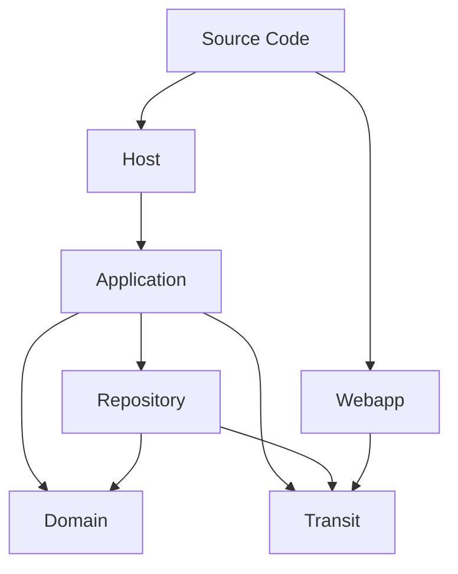
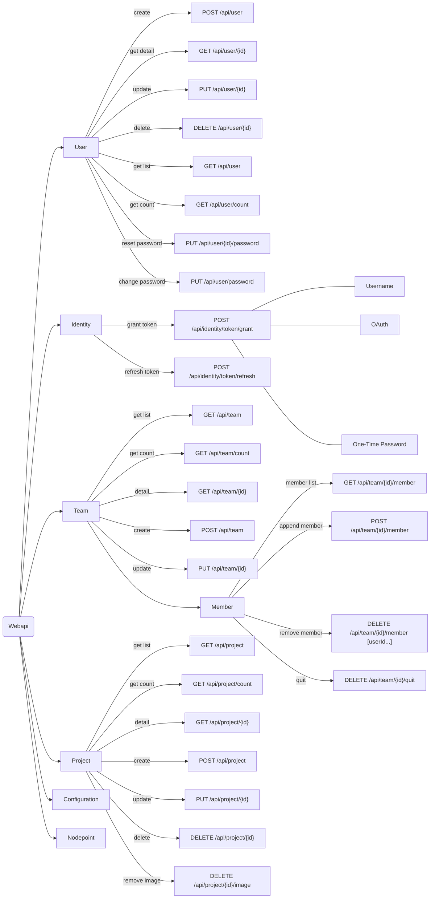

## Source Code Architecture

### Architecture Diagram

### Host

The Host layer is responsible for managing the application's lifecycle, including initialization, configuration, and
dependency injection. It sets up the environment in which the application runs.

### Application

The Application layer contains the core business logic and orchestrates the interactions between different components.
It is responsible for handling use cases and coordinating data flow between the Repository, Domain, and Transit layers.

### Repository

The Repository layer acts as an intermediary between the Application layer and data sources. It abstracts the data
access logic, providing a clean interface for the Application layer to interact with databases, APIs, or other data
sources.

### Domain

The Domain layer encapsulates the business rules and entities of the application. It defines the core concepts and logic
that are independent of any specific application or infrastructure concerns.

### Transit

The Transit layer handles data transfer between different parts of the application or between the application and
external systems. It is responsible for serialization, deserialization, and communication protocols.

### Webapp

The Webapp layer is responsible for the user interface and user experience of the application. It manages the
presentation logic and interacts with the Application layer to display data and handle user input.

## Webapi Guidelines

### Mind map

